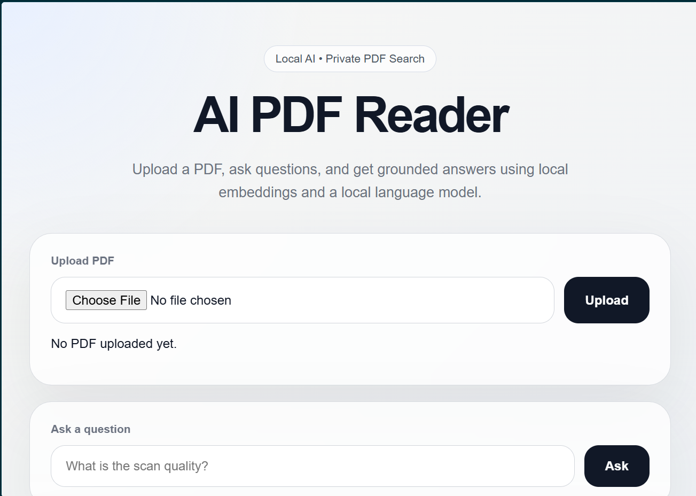
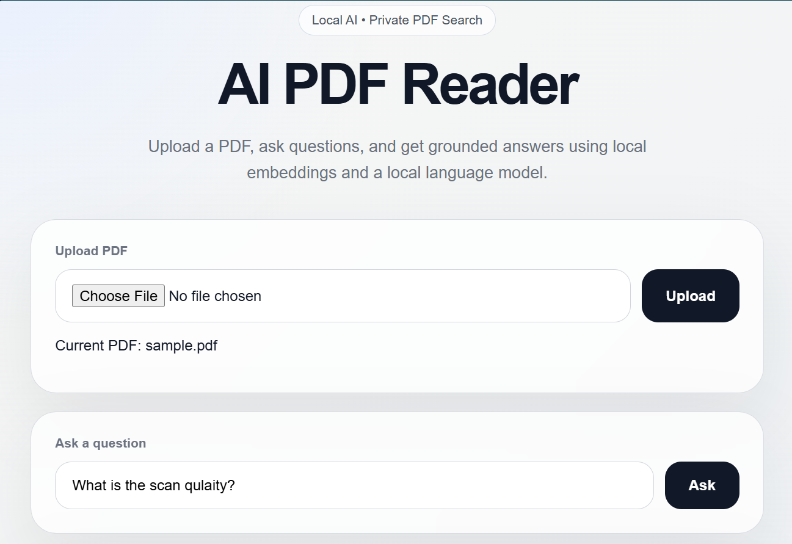
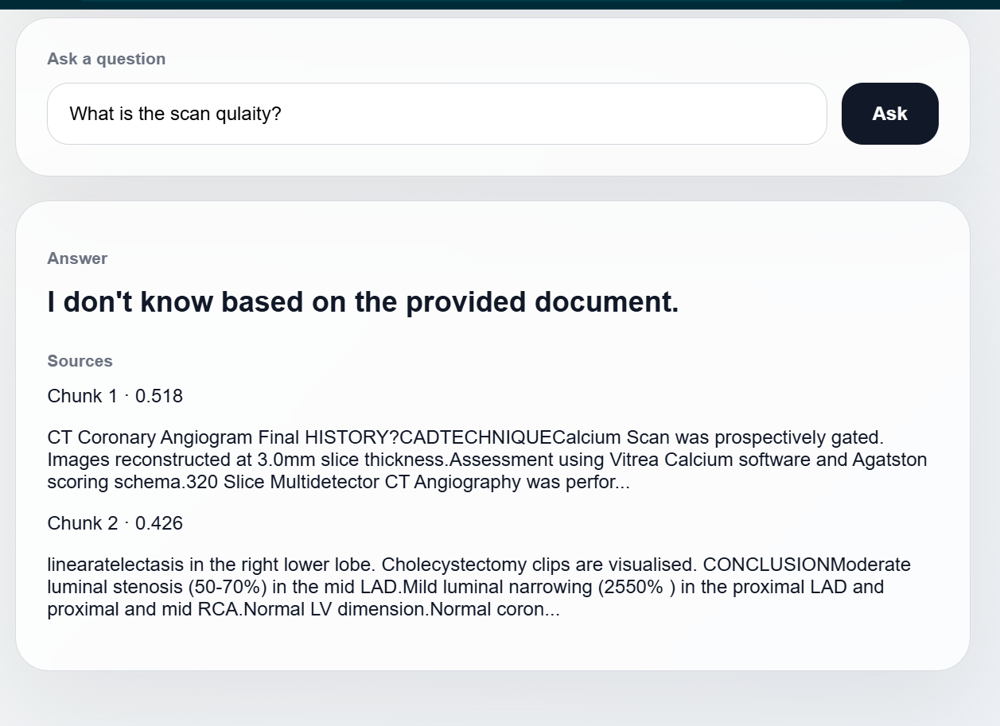

# AI PDF Reader

A local AI-powered PDF question-answering app built with FastAPI, Ollama, embeddings, and semantic search.

The app allows users to upload a PDF, ask questions about its content, and receive grounded answers with source chunk references. It runs locally using Ollama, making it suitable for privacy-focused document question answering.

## Screenshots

### Home Page



### PDF Uploaded



### Answer with Sources



## Features

- Upload a PDF
- Extract text from the PDF
- Split text into chunks
- Generate local embeddings using Ollama
- Retrieve relevant chunks using cosine similarity
- Generate answers using a local LLM
- Show source chunks with similarity scores and previews
- Runs locally without sending documents to cloud AI APIs

## Tech Stack

- Python
- FastAPI
- Ollama
- nomic-embed-text
- llama3.2:1b
- pypdf
- NumPy
- HTML/CSS

## Project Flow

```text
Upload PDF
→ Extract text
→ Split text into chunks
→ Generate chunk embeddings
→ Ask a question
→ Generate question embedding
→ Retrieve similar chunks
→ Build context
→ Generate answer using local LLM
→ Show answer and sources


How to Run
1. Clone the repository
git clone https://github.com/MShaswat03/ai-pdf-reader.git
cd ai-pdf-reader
2. Install dependencies
pip install -r requirements.txt
3. Install and start Ollama

Make sure Ollama is installed and running on your machine.

Pull the required models:

ollama pull nomic-embed-text
ollama pull llama3.2:1b

If Ollama is not already running, start it:

ollama serve
4. Run the FastAPI app
uvicorn app:app --reload

Open the app in your browser:

http://127.0.0.1:8000
Local-First Design

This project is designed as a local AI application. The PDF is processed locally, embeddings are generated locally, and the answer is generated using a local Ollama model.

This makes the project useful for privacy-focused document analysis where users may not want to upload sensitive documents to cloud AI services.

Current Limitation

This project currently runs locally. It is not deployed as a public cloud web app because Ollama must be running on the same machine or server as the FastAPI backend.

Possible Future Improvements
Add page-number citations
Support multiple uploaded PDFs
Store embeddings in a vector database
Add chat history
Add Docker support
Deploy on a cloud VM with Ollama installed
Improve PDF parsing for scanned documents using OCR
Author

Manishansh Shaswat